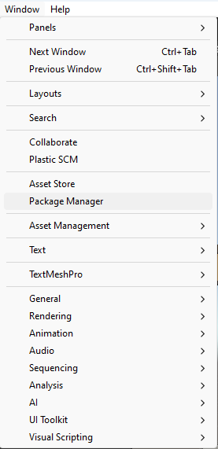
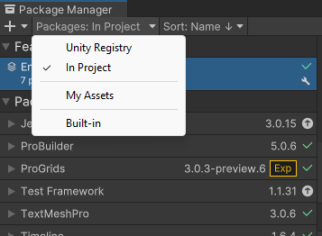
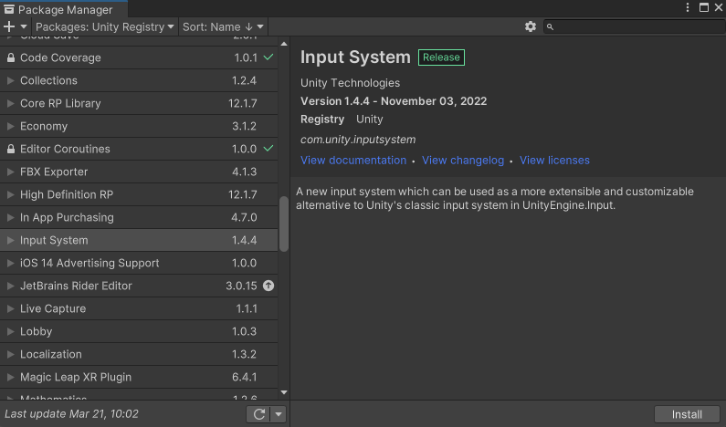
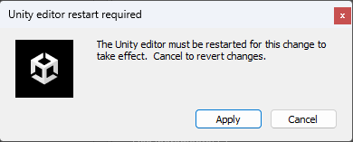
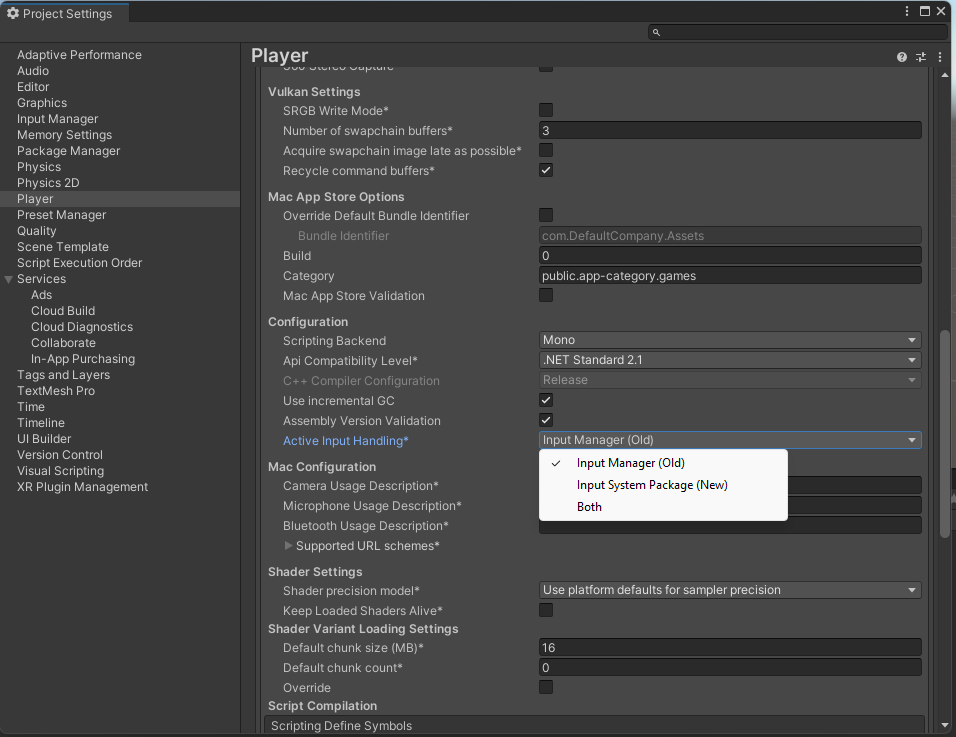

If you are a Unity developer, you might have heard of the new Input System that was introduced in Unity 2019.1 as a preview package and became verified for Unity 2019 LTS and later versions. The new Input System is a complete rewrite of the old `UnityEngine.Input` system that aims to provide a more flexible, consistent, and easy-to-use interface for handling input from various devices and platforms.

In this blog post, I will explain some of the main benefits of using the new Input System, and show you how to get started with it in your own projects.

## Why use the new Input System?

The old input system was designed before Unity supported many of the platforms and devices that we have today. It had some limitations and drawbacks, such as:
- It only supported a fixed set of input devices, such as keyboard, mouse, joystick, and touch screen. Adding support for new devices or custom controllers required writing native plugins or using third-party solutions.
- It used polling-based APIs that required checking the state of each input device every frame. This could lead to performance issues or missed inputs if the frame rate was low or inconsistent.
- It did not handle device hot-plugging well. If a device was disconnected or connected after the game started, it could cause unexpected behavior or errors.
- It did not support complex input scenarios, such as multiple players using different devices or control schemes, gesture recognition, haptics feedback, or XR interactions.

The new Input System addresses these issues and offers many advantages over the old one:

- It supports an unlimited number and mix of devices across all platforms. You can use any device that conforms to a common set of HID specifications , such as keyboards, mice, gamepads, joysticks, steering wheels, flight sticks, touch screens, pen tablets, VR controllers, AR glasses, eye trackers, etc. You can also create your own custom devices using scripts or native plugins.
- It uses event-based APIs that notify you when an input event occurs on any device. This reduces CPU overhead and ensures that no inputs are lost or delayed due to frame rate fluctuations.
- It handles device changes gracefully at runtime. You can subscribe to notifications when a device is connected or disconnected , and query information about any device at any time.
- It supports advanced input features such as action mapping, control schemes, player input management, input processing & interactions, haptics feedback, etc.

## How to use the new Input System?
### Install Input System
To use the new Input System in your project, you need to install it via the Package Manager.

1. Open Unity's package manager (menu: Window > Package Manager).

    

2. Switch (if needed) the package repository to `Unity Registery`

   

3. Select the Input System package from the list, then click Install.
   
   

4. When you install the Input System package, Unity will ask whether you want to enable the new backends. If you click Yes, Unity will enable the new backends and disable the old backends, and the Editor will restart.

   

5. You can find the corresponding setting in the Player settings (menu: Edit > Project Settings > Player), under Active Input Handling. 
You can change this setting at any time. Doing so will restart the Editor.

   

> Note: The new Input System requires Unity 2019.1+ and the .NET 4 runtime. 
> It doesn't work in projects using the old .NET 3.5 runtime.

### Setup Input System Actions
The core concept of the new Input System is an Action . An Action represents something that your game logic responds to when an input event occurs on any device. For example: move left/right/up/down; jump; fire; interact; pause; etc.

You can define Actions in two ways: using an Asset file (InputActionAsset) or using C# scripts (InputAction). The Asset file approach is recommended for most cases because it allows you to edit Actions visually in a dedicated editor window (Window > Analysis > Input Debugger > Edit Asset).

In this window, you can create Action Maps that group related Actions together (e.g., Player Controls), assign Bindings that link Actions to specific inputs on specific devices (e.g., W/A/S/D keys on Keyboard), and define Control Schemes that specify which devices are compatible with which Actions (e.g., Keyboard + Mouse).

You can also use PlayerInput components on GameObjects in your scene to automatically manage player input based on your Action Asset file . The PlayerInput component handles creating and enabling/disabling Action Maps based on game state (e.g., gameplay vs menu), sending callbacks when Actions are performed (e.g., OnMove(), OnFire()), spawning prefabs for each player instance (e.g., PlayerCharacter), joining/leaving players dynamically (e.g., Split-screen), switching Control Schemes based on connected devices (e.g., Gamepad vs Keyboard + Mouse), etc.

Alternatively, you can use C# scripts to create Actions programmatically if you need more flexibility or control over how they work. You can use InputAction objects directly in your scripts by calling methods like AddBinding(), Enable(), Disable(), performed += callback;, etc.

You can also access low-level information about any device by using InputDevice objects . You can query properties like name , displayName , description , layoutName , etc., read states like buttons , axes , sensors , etc., write outputs like rumble motors , LEDs lights ,, etc., listen for events